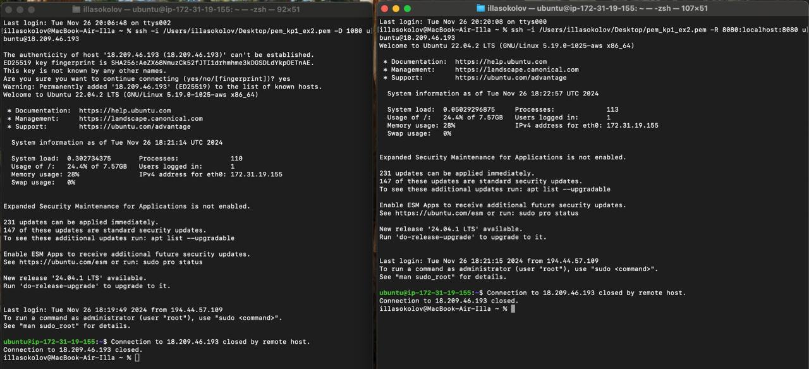

# run

1. In `userdata.sh` change `SECURITY_GROUP_ID`

```bash
ssh -i /Users/illasokolov/Desktop/pem_kp1_ex2.pem -D 1080 ubuntu@<ec2_54.234.40.44>

ssh -i /Users/illasokolov/Desktop/pem_kp1_ex2.pem -R 8080:localhost:8080 ubuntu@<ec2_54.234.40.44>
```

### check :8080
```bash
sudo lsof -i :8080
```